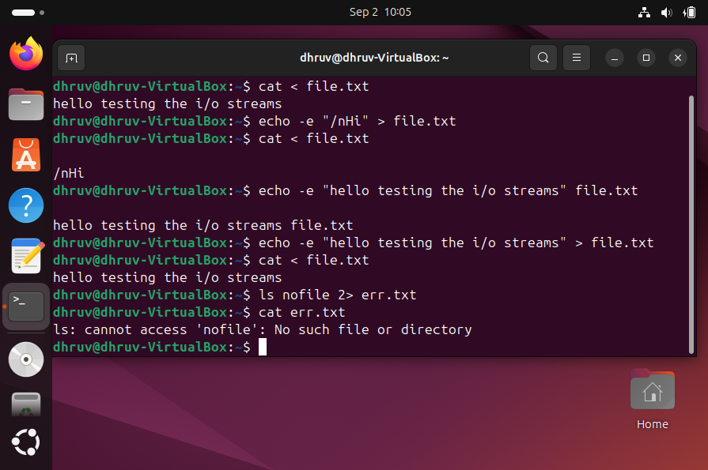
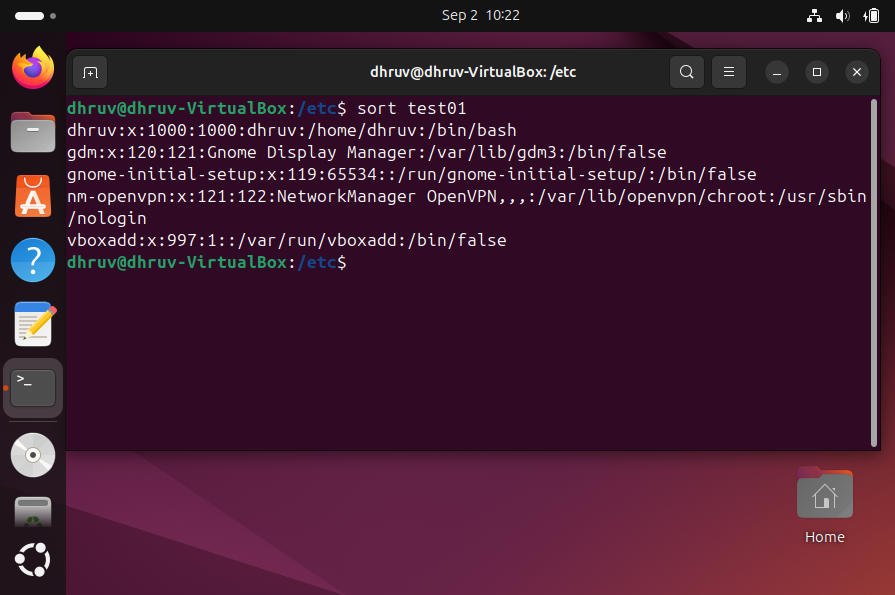
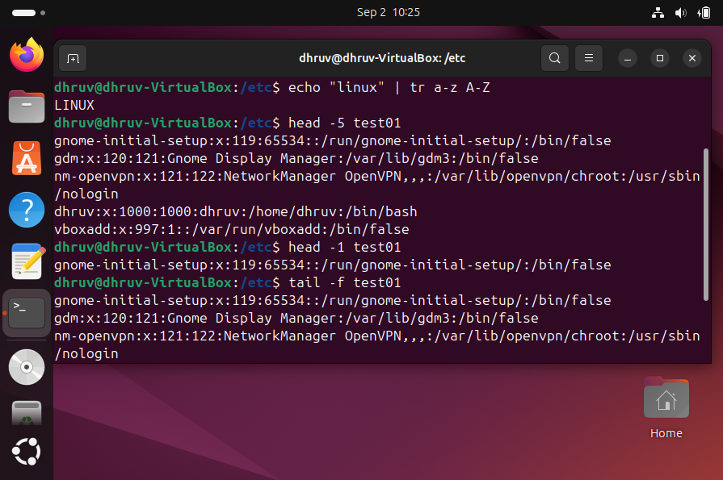
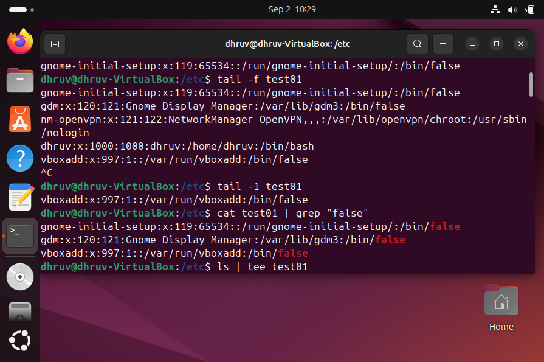

# Linux Commands Quick Reference

## I/O Streams

### stdin
Standard input (keyboard/file).  
Example: `cat < file.txt`  

### stdout
Standard output (screen/file).  
Example: `echo "Hi" > out.txt`  

### stderr
Standard error (error messages).  
Example: `ls nofile 2> err.txt`  

---

 
## File Commands

### echo
Prints text to output.  
Example: `echo "Hello World"`  

### cut
Extracts columns or fields.  
Example: `cut -d"," -f1 data.csv`  

### paste
Merges files line by line.  
Example: `paste f1.txt f2.txt`  

### sort
Sorts lines in a file.  
Example: `sort names.txt`  

### tr
Translates or deletes characters.  
Example: `echo "hi" | tr a-z A-Z`  

### join
Joins files on a common field.  
Example: `join f1.txt f2.txt`  

### split
Splits large files into smaller chunks.  
Example: `split -b 1M bigfile part_`  

### head
Shows first lines of a file.  
Example: `head -n 5 file.txt`  

### tail
Shows last lines of a file (with `-f` for live logs).  
Example: `tail -f log.txt`  

### nl
Adds line numbers to file content.  
Example: `nl notes.txt`  

### wc
Counts lines, words, and characters.  
Example: `wc -l file.txt`  

### expand
Converts tabs to spaces.  
Example: `expand file.txt`  

### unexpand
Converts spaces to tabs.  
Example: `unexpand file.txt`  

---

  
## Pipe

### pipe (|)
Sends output of one command as input to another.  
Example: `cat f | grep error`  

### tee
Writes output to screen and file.  
Example: `ls | tee list.txt`  

---

  
## Filters

### uniq
Removes duplicate lines (only adjacent).  
Example: `uniq sorted.txt`  

### grep
Searches for patterns in text.  
Example: `grep "error" log.txt`  

### awk
Processes text by fields or patterns.  
Examle: `awk '{print $1}' file.txt`
